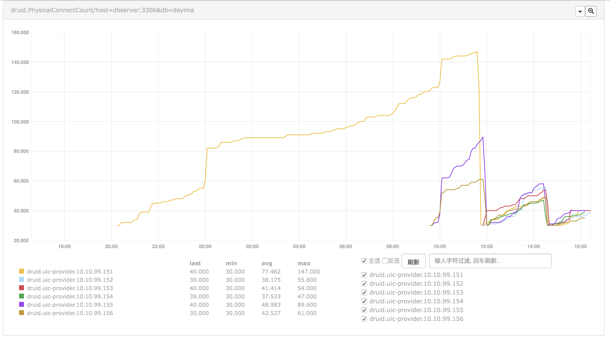

Why We Need Monitoring Druid
===

# Issue occurred
Recently there is a very strange problem happening every night on about 20:00:05. The `SELECTED` provider (DUBBO) will reach the capacity of DUBBO thread pool which is limit to **2000** threads and in **fixed** pool model. Most of them blocked in the position of fetching connections through druid:

```java
        -  waiting on java.util.concurrent.locks.AbstractQueuedSynchronizer$ConditionObject@63c4ac4b
        at java.util.concurrent.locks.LockSupport.parkNanos(LockSupport.java:215)
        at java.util.concurrent.locks.AbstractQueuedSynchronizer$ConditionObject.awaitNanos(AbstractQueuedSynchronizer.java:2078)
        at com.alibaba.druid.pool.DruidDataSource.pollLast(DruidDataSource.java:1479)
        at com.alibaba.druid.pool.DruidDataSource.getConnectionInternal(DruidDataSource.java:1079)
        at com.alibaba.druid.pool.DruidDataSource.getConnectionDirect(DruidDataSource.java:946)
        at com.alibaba.druid.filter.FilterChainImpl.dataSource_connect(FilterChainImpl.java:4544)
        at com.alibaba.druid.filter.stat.StatFilter.dataSource_getConnection(StatFilter.java:661)
        at com.alibaba.druid.filter.FilterChainImpl.dataSource_connect(FilterChainImpl.java:4540)
```

# Analysising
First we can find that it seems like many threads stuck inside pollLast(). Precisely on `notEmpty.awaitNanos()`. Maybe it is caused by some forms of dead lock or racing problem. Which is even more strange why we use `SELECTED` before there is only `ONE` node suffered this issue while we have 6 nodes all together.

So There maybe some rarely executed invocation or scheduled task causing this problem.

Currently we use the version `1.0.10` while the newest release is `1.1.12`. So we can try to upgrade it.

Besides we can introduce more metrics of the `Druid Pool` to `Open Falcon` and see whether there are some other reasons.

# Next
We will try:

* [x] Support monitoring for projects having druid.
* [x] Upgrade druid from 1.0.10 to 1.1.12.
* [x] Adjust pool's parameters according to the monitor results.

## NotEmptyWaitCount
First we found the curve of `NotEmptyWaitCount` telling that there maybe some problems in the pool at some traffic fluctuation points(Shown below).  


We can see when sudden traffic incoming the wait count increased.  

## PhysicalConnect
And we compared another indicator `PhysicalConnect`:  

  

We can also be sure when wait count increased some physical connecting actions were really happened.

## PoolingCount
After some iteration of pool parameters including increasing `minIdle` and `initialSize` we checked the indicator `PoolingCount` which can indicate the connection count in idle.  

  

We can see the pool can't keep the count of idle connections as we expected(minIdle = initialSize = 20). And it keeps changing after some minutes. So if recycleThread didn't recycle them there must be some other reasons causing them destroyed. And we checked that we enabled `testWhileIdle` while disabling `testOnBorrow` and `testOnReturn`. We thought that idle connections will be checked periodically by setting `testWhileIdle` but things didn't indicate the same result.  

After reading the source code for a while we found there was really a misunderstanding on `testWhileIdle`.

# Pool Parameters Related
## initialSize vs. minIdle
`initialSize` means when pool starts how many connections will be created.  
`minIdle` means when evictThread runs how many connections will prevent to be destroyed.  

So generally `initialSize` may be greater or equals to `minIdle`.

## timeBetweenEvictionRunsMillis vs. minEvictableIdleTimeMillis
`minEvictableIdleTimeMillis` means how long a connection turns to be useless when in idle. But when it's in `minIdle` range **it will ignore this**.

`timeBetweenEvictionRunsMillis` means the time between recycle thread's loop.

## testWhileIdle vs. testWhileIdle
`testWhileIdle` doesn't mean test occurred while a connection is in idle but when a connection is borrowed and has been in idle more then `timeBetweenEvictionRunsMillis` the connection test will happen.  

That is **test when borrowed a long-idle connection**. The test will only happen in getConnection as `testOnBorrow` means which is more efficient.  

So if you have some timeout settings on server side you may want to use `keepAlive`.

## keepAlive
`keepAlive` means when a connection is in idle a connection test will happen on it every `timeBetweenEvictionRunsMillis`. It enhances the recycleThread.  

We can be sure of all idle connections's status using it.


# Conclusion
Connections in idle pool(Which is calculated as `poolCount`) is not reliable when you turn off `testOnBorrow`. And if you have some big fluctuations of load, for example, you will also take time to reconnect with turning on `testOnBorrow`. That  will lead to poor performance when fluctuations occur.  

So we can turn on the `keepAlive` option to really keep alive the connections in idle (`minIdle`) to get prepared to the fluctuations.

```xml
<property name="initialSize" value="40" />
<property name="minIdle" value="40" />
<property name="maxActive" value="1000" />
<property name="maxWait" value="60000" />
<property name="timeBetweenEvictionRunsMillis" value="180000" />
<property name="minEvictableIdleTimeMillis" value="600000" />
<property name="validationQuery" value="SELECT 'x'" />
<property name="testWhileIdle" value="true" />
<property name="testOnBorrow" value="false" />
<property name="testOnReturn" value="false" />
<property name="keepAlive" value="true" />
```


By the way the problem of `NotEmptyWaitCount` is solved at the same time.


