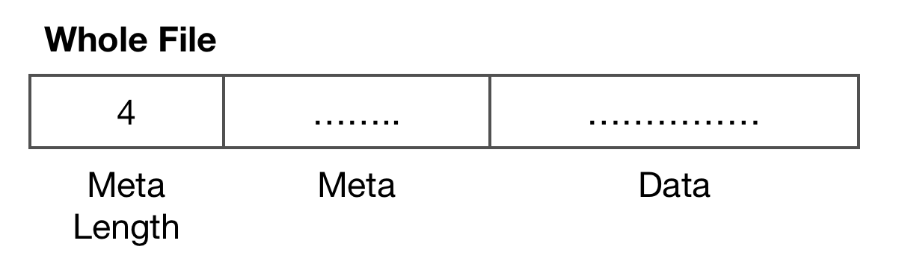
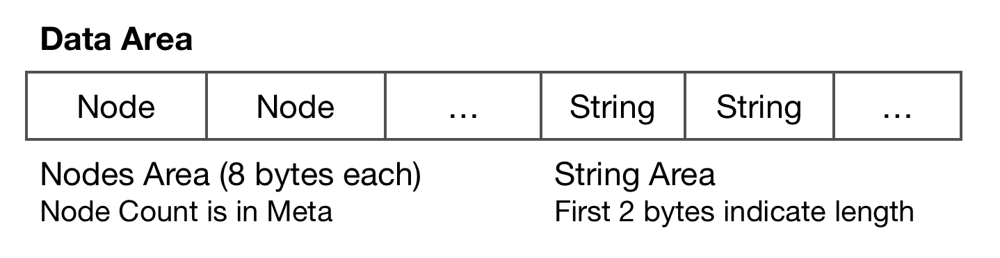
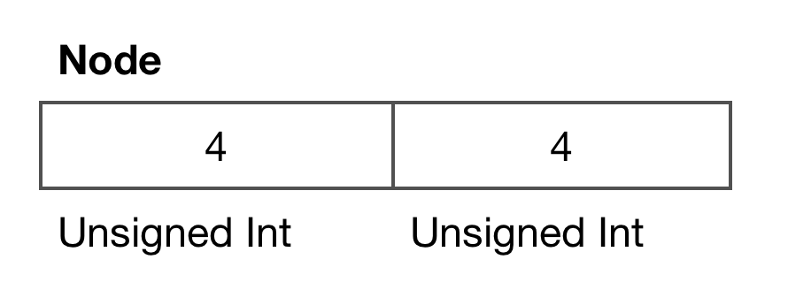
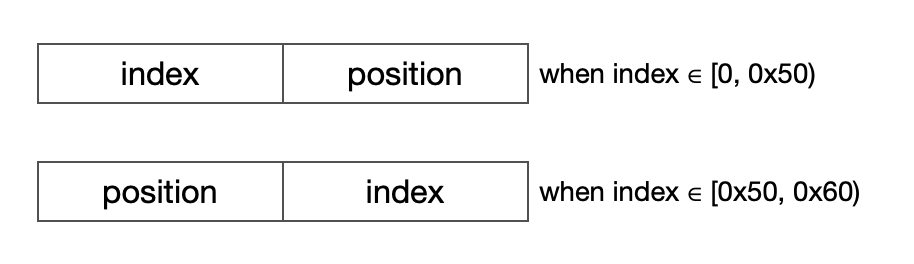
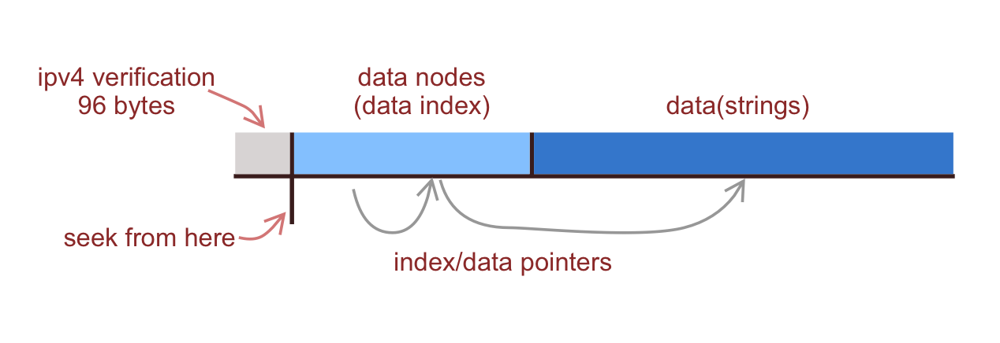
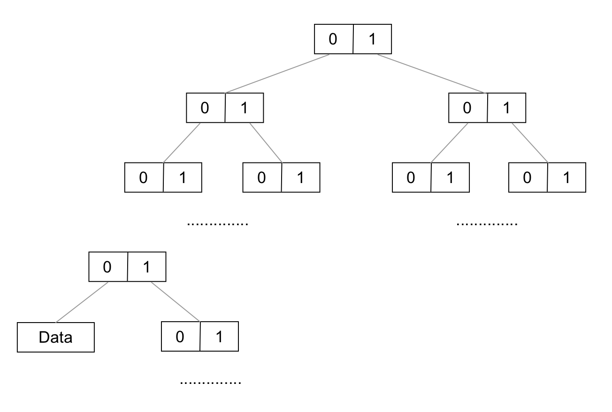
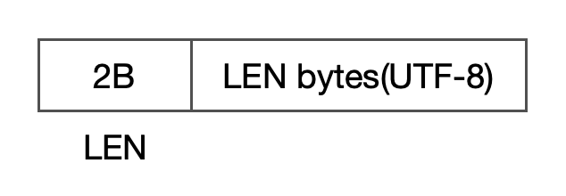

IPDB Structure
===

- date: 2019-01-24
- tags: ipdb, java

------------

# Intro
IPDB is a new file format from https://ipip.net storing ip geo data.  
It can support `more records` and `IPV4` records compared to old format `dat`.  
Though there are kinds of resolver libraries on official website(Which can be found at https://www.ipip.net/support/code.html) but there was no document on structure of it yet.  

Actually if you want to improve the performance or make a custom implementation it will be better if there was one. So i spent some time comparing the hex of file and the java code provided officially and write it down.  

```
Note: This document is based on the free library which contains IPV4 data only.
```

# File Structure
  

## Meta
A json string like:  

```json
{
	"build": 1547017060,
	"ip_version": 1,
	"languages": {"CN": 0},
	"node_count": 411432,
	"total_size": 3330322,
	"fields": [
		"country_name",
		"region_name",
		"city_name"
	]
}
```

# Data
  

## Node
  

Node is a 8 bytes record.  
Generally first part is `index` while second part is `position`.  
But `the order of index and position is inverted` when index value is greater or equal then `80`. Maybe they changed the format for some reasons and here is for backward compatibility.

Indexes between 0 ~ 96(not included) are for IPV4 verification(real index nodes should be located after traversal): 



Then the real indexes start from index 96. In summary the structure is:

 

The structure of data indexes is a tree based on each bit of ip address from bit0 to bit31. The maximum depth is 32 and it terminates at the index of next node which will beyond the maximum index(node_count in meta).

 

## Data Entry

The result is stored in data entry separated by TAB in UTF-8 charset. First 2 bytes store the length of string followed.

 

# Optimization

For best practice there are mainly two spots we can introduce a cache for.

First is the depth of the tree. We can reduce it from 32 in maximum to 16 after introducing a 16 bits cache, that is, 65535 entries. We can build it once when loading into memory. It can help taking 50% off in time complexity.

Second is we can build a LRU data cache because there are duplicated locations that different addresses point to. 


