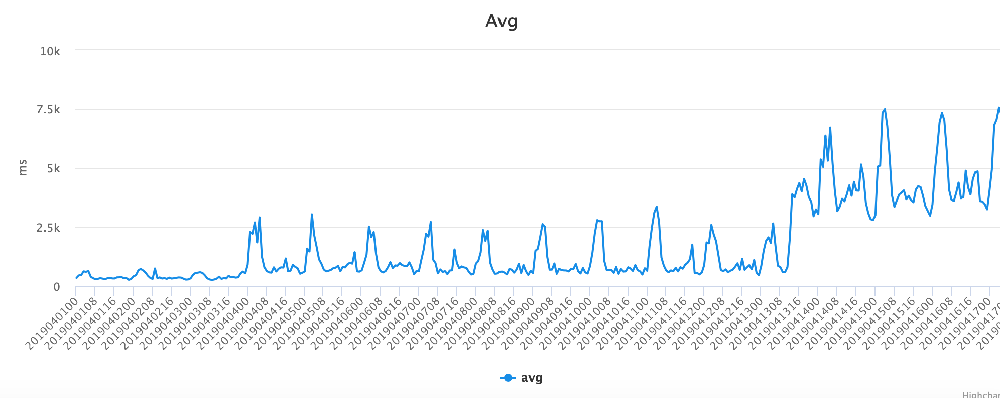
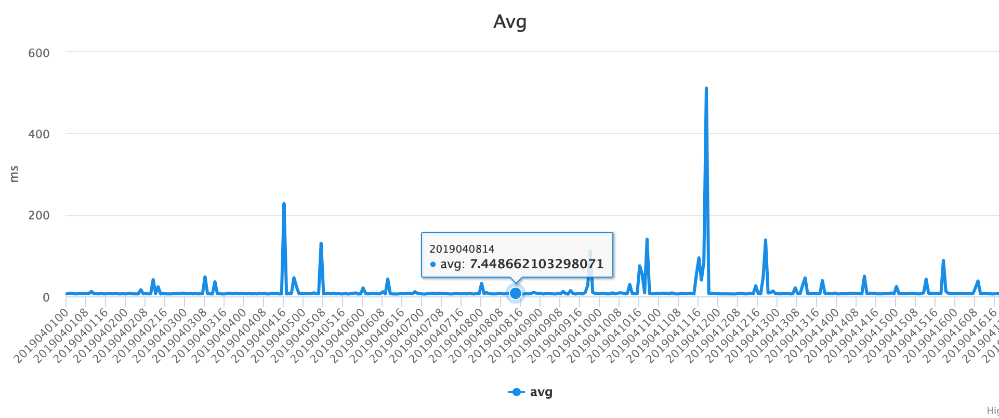
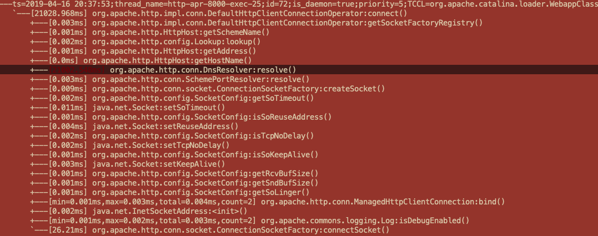

Java's Hostname Resolving Problem
===

- date: 2019-04-17
- tags: InetAddress, java

------------

# Abstract
Java 8 on CentOS 5 will do extra PTR lookup when executing `InetAddress.getAllByName` for resolving. The extra PTR lookup will cause poor performance. We need replace it to custom implementation using custom name service or downgrade back to **Java 7**.  

Java 7/8 or newer on CentOS 7 have no such issue.

# Issue
Recently the latency of some API in production are deteriorated as Figure 1 shown:  

 

No change in relevant code and no change on cluster environment. It's strange. So a two-day-figuring journey begun.

# Locate The Code Block

## Using Logging
It seems like an easy problem so i add several logging lines with execution timing. They cut the logic into several parts. And finally we arrived here:  

```java
String json = HttpClientUtil.postRequest(url, map);
JSONObject jsonObject = JSONObject.parseObject(json);
if (jsonObject != null && jsonObject.containsKey("data")) {
 JSONObject dataObject = jsonObject.getJSONObject("data");
 if (dataObject != null && dataObject.containsKey("oriPic")) {
     String pic = dataObject.getString("oriPic");
     if (StringUtils.isNotEmpty(pic)) {
         return SearchUtils.IMG_HOST + pic;
     }
 }
}
```  

The api outside also has performance statistic as Figure 2:  

  

Which means it's running good(avg < 10ms).  
So I add a timeout(2 seconds) to make it better first as:  

```java
String json = HttpClientUtil.postRequest(url, map, 2000);
```

But things have not changed.  
So I dug in the access logs for global view and found:  

```
20190415155616	0.602
20190415155628	0.094
20190415155631	0.234
20190415155632	21.892
20190415155632	1.852
20190415155650	0.04
20190415155652	0.017
20190415155654	0.282
20190415155701	0.18
20190415155720	0.484
20190415155735	0.28
20190415155756	0.04
20190415155809	0.295
20190415155814	0.342
20190415155840	0.104
20190415155849	0.081
20190415155854	21.612
20190415155854	20.648
20190415155856	21.539
20190415155858	0.538
20190415155901	0.04
20190415155904	0.223
20190415155906	0.04
20190415155915	0.687
20190415155949	0.038
20190415155954	0.436
```

There are some **extremely** slow requests. It seems like the **timeout** doesn't act what i expect. It turns to be complicated because `HttpClientUtil` is a common util widely used and it should not have such bug. So i turn to Arthas[1] to go deeper.

## Using Arthas
### Intro
Arthas is a Java Diagnostic tool open sourced by Alibaba.  

Arthas allows developers to troubleshoot production issues for Java applications without modifying code or restarting servers.  

Github: https://github.com/alibaba/arthas  

It's a great help in this case.

### Go Deeper
After step-by-step debugging with the commands of `watch` and `trace` finally arrived:  

  

Because `Arthas` cannot advise system api so the issue focused on `InetAddress.getAllByName` now.  

`getAllByName` is used to convert/resolve hostname into ip address. But tests show that dns server has no problem:  

```shell
[root@peon1 ~]# time nslookup google.com
Server:		172.16.1.2
Address:	172.16.1.2#53

Non-authoritative answer:
Name:	google.com
Address: 216.58.197.110


real	0m0.011s
user	0m0.000s
sys	0m0.000s
```

Then I use `tcpdump` to see what happens actually and find the problem:  

```
10:59:32.809499 IP (...) 172.16.2.4.64563 > 172.16.1.2.53: [udp sum ok]  19342+ A? ******.com. (37)
10:59:32.809966 IP (...) 172.16.1.2.53 > 172.16.2.4.64563:  19342 q: A? ******.com. 2/2/18 ******.com. A aa.bb.cc.dd, [|domain]
10:59:32.810303 IP (...) 172.16.2.4.12547 > 172.16.1.3.53: [udp sum ok]  8474+ PTR? dd.cc.bb.aa.in-addr.arpa. (44)
problem >>> 11:00:01.118759 IP (...) 172.16.1.3.53 > 172.16.2.4.12547: [udp sum ok]  8474 ServFail q: PTR? dd.cc.bb.aa.in-addr.arpa. 0/0/0 (44)
```

Wtf? Why it perform a `PTR`[2] lookup?  
It can be reproduce by:  

```shell
[root@peon1 ~]# time nslookup aa.bb.cc.dd
;; Got SERVFAIL reply from 172.16.1.2, trying next server
;; connection timed out; no servers could be reached


real	0m20.296s
user	0m0.000s
sys	0m0.000s
```

Generally we don't need a PTR lookup when performing a normal http request. So that is the problem.  

# Environment Research
I write a test to reproduce the issue between different versions and environments:  

```java
import java.net.InetAddress;
import java.net.UnknownHostException;

public class Test {
	public static void main(String[] args) throws InterruptedException, UnknownHostException {
	    while (true) {
    	    InetAddress.getAllByName("google.com");
    		Thread.sleep(40000);
	    }
	}
}
```

I run it on CentOS 5/7 and Java 7/8:

- | CentOS 5 | CentOS 7
--- | --- | ---
Java 7 | - | -
Java 8 | PTR Lookup | -

After some tests it seems like problems only exist when using Java 8 on CentOS 5. And I also write a C test to make sure relevant system api works correctly:

```c
#include <stdio.h>
#include <string.h>
#include <stdlib.h>
#include <sys/socket.h>
#include <errno.h>
#include <netdb.h>
#include <arpa/inet.h>
#include <unistd.h>

void resolve() {
	struct hostent *he;
	struct in_addr **addr_list;
	int i;
	he = gethostbyname("google.com");
	if (he == NULL) {
		printf("resolve error\n");
		return;
	}
	addr_list = (struct in_addr **)he->h_addr_list;
	for (i = 0; addr_list[i] != NULL; i ++) {
		if (i > 0) printf(".");
		printf("%s", inet_ntoa(*addr_list[i]));
	}
	printf("\n");
}

int main() {
	while (1) {
		resolve();
		sleep(40);
	}
	return 0;
}
```

It hasn't similar issues both on CentOS 5/7.

# Solution
Things go right after changing the default JDK to `1.7.0_71`.(Only on CentOS 5.x)

# Question Remained
What's the real difference in JNI implementation between 7/8 which causes this issue on specific condition?

# Reference
[1] Arthas JVM Debugger https://github.com/alibaba/arthas  
[2] Reverse DNS lookup https://en.wikipedia.org/wiki/Reverse_DNS_lookup

