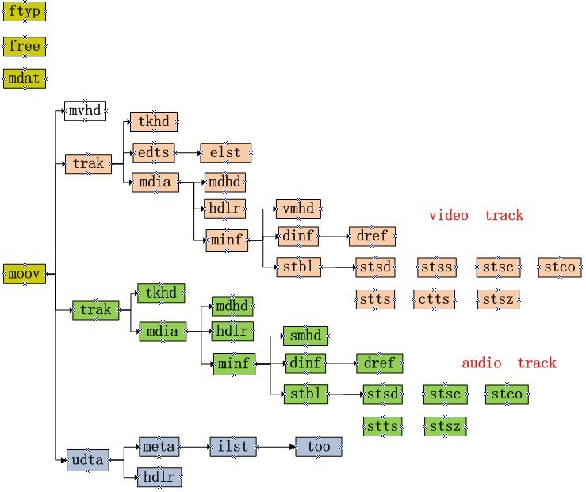

An Efficient Way to Detect h264 Video Format
===

- date: 2020-06-22
- tags: h264, video, mpeg, java

------------

# Background

We want to introduce short video clips as a new business into our product. For a startup we have numbers of videos which have length in time from 50 seconds to more than 5 minutes.

But there is a problem importing them into the new business: Some of them aren't in h264 format which will not be supported in mobiles. We need to convert them into h264 before importing. So we need an efficient way to "scan" and pick them out then convert them into compatible format.

# ffmpeg Way

The first tool comes into mind is `ffmpeg`. We can download them first and use ffmpeg to get the video information to make the conclusion. But it will cost so much bandwidth and time to do so. So we pick it as an option if we don't find any more efficient way.

# MPEG Structure

After researching on how data is organized in MPEG file[1][2] we found that there are only quite small size data which is needed to decide encoding of video stream. We don't need to read the whole file actually.

The MPEG file is organized by `boxes`. Each box represents different meta information and we can skip from one box to another according to the header of box. By doing this we can traverse the whole file by several small reads each read can be limited under 10kB. The box tree is demonstrated below:

Demo code could be reached at https://github.com/jasonjoo2010/h264-detector

# Reference

[1] ISO/IEC base media file format https://en.wikipedia.org/wiki/ISO/IEC_base_media_file_format  
[2] ISO 14496-1 Media Format http://xhelmboyx.tripod.com/formats/mp4-layout.txt  

